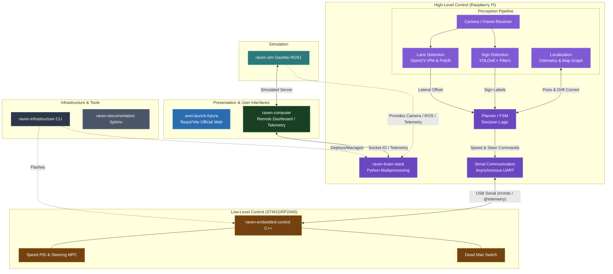

# BFMC - Computer Project

The project contains all the provided code that will run on the PC, and it's made of 4 parts:
- carsAndSemaphoresStreamSIM: The simulated stream. Sends random, simulated data about the semaphores and the cars on the track, just as our servers at the Bosch location.
- trafficCommunicationServer: The simulated server of the challenge. The car can get from this server the IP of the localization device and send to it information during the run (Speed, position, rotation and encountered obstacles.)

## 🌍 Global System Architecture



## 🎮 Remote Control Dashboard

A new web-based dashboard has been added to control the car manually.

### Features
- **Real-time Control**: Drive the car using keyboard inputs.
- **Telemetry**: View Speed, Steering Angle, Battery, and IMU data.
- **Connection Status**: visual indicator for Brain connectivity.

### Controls
- **W / Up Arrow**: Accelerate
- **S / Down Arrow**: Brake / Reverse
- **A / Left Arrow**: Steer Left
- **D / Right Arrow**: Steer Right
- **SPACE**: Emergency Brake

### Usage
The dashboard is automatically launched on **Port 5000** when you run:
```bash
raven start manual
```

## The documentation is available in more details here:
[Documentation](https://boschfuturemobility.com/brain/)
